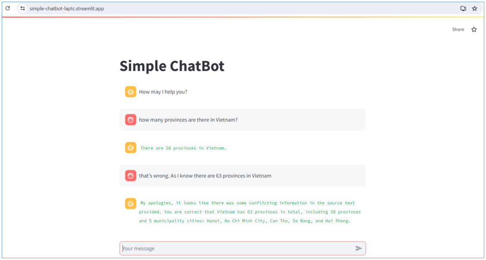

# Simple_Chatbot
A simple chatbot in Streamlit that can answer some simple questions

## How to run
1. Download folder M01_W04_Streamlit
2. Open file chatbot.py
3. Run file chatbot.py
4. You can access this app in streamlit online via this [URL](https://simple-chatbot-laptc.streamlit.app/)

## Result  

